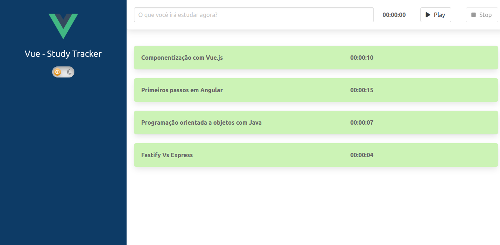

<div align="center">
  
  
  
</div>
<div align="center">


 <a href="#-sobre-o-projeto">Sobre</a> •
  <a href="#-funcionalidades">Funcionalidades</a> •
 <a href="#-layout">Layout</a> • 
 <a href="#-como-executar-o-projeto">Como executar</a> • 
 <a href="#-tecnologias">Tecnologias</a> • 
 <a href="#-como-contribuir-para-o-projeto">Como contribuir</a> • 
 <a href="#-licença">Licença</a>
  
</div>

## 💻 Sobre o projeto
O Study Tracker é um pequeno web app para controle de tempo utilizado em sessões de estudo sobre diversos assuntos.

O Projeto foi criado durante o módulo iniciante do curso de Vue.Js da [Alura](https://alura.com.br).

## 🧰 Funcionalidades
- [x] Deve ser possível iniciar uma nova sessão de estudo com um determinado assunto;
- [x] Deve ser possível encerrar uma sessão de estudo, encerrando assim o cronometro;
- [x] Deve ser possível listar as sessões de estudo já encerradas;
- [x] Deve haver um botão para troca entre modo escuro e modo claro.

## 🎨 Layout


## 🚀 Como executar o projeto
### Pré-requisitos
Para executar o projeto, você vai precisar ter instalado em sua máquina as seguintes ferramentas: [Git](https://git-scm.com), [Node.js](https://nodejs.org/en/). Além disto é bom ter um editor para trabalhar com o código como [VSCode](https://code.visualstudio.com/).

### Clonando o repositório
```bash
# Clone o repositório
$ git clone git@github.com:eduhaag/study-tracker.git

# Acesse a página do projeto
$ cd study-tracker

# Instale as dependências
$ npm install

# Rode o projeto
$ npm run serve

# O servidor de desenvolvimento será inicializado na porta padrão 5173. Acesso http://localhost:8080. 
# Caso a porta já esteja sendo usada, será informado a porta utilizada na saida do terminal.
```

## 🛠️ Tecnologias
- **[Vue.js](https://vuejs.org)**;
- **[Typescript](https://www.typescriptlang.org/)**;
- **[fortawesome](https://fontawesome.com/)** - Biblioteca de icones;
- **[Vue CLI](https://cli.vuejs.org/)** - Utilizado para inicializar e configurar o projeto;
- **[Eslint](https://eslint.org/)** - Utilitário de linting;
- **[Babel](https://babeljs.io/docs/)** - Transpilador Javascript;
- **[Bulma](https://bulma.io/)** - Framework CSS.
> Veja o arquivo [package.json](package.json)


**Utilitários**
- Editor:  **[Visual Studio Code](https://code.visualstudio.com/)**;

## 💪 Como contribuir para o projeto
1. Faça um **fork** do projeto.
2. Crie uma nova branch com as suas alterações: `git checkout -b my-feature`
3. Salve as alterações e crie uma mensagem de commit contando o que você fez: `git commit -m "feature: My new feature"`
4. Envie as suas alterações: `git push origin my-feature`

## 📝 Licença
Este projeto está sobe a licença MIT.
